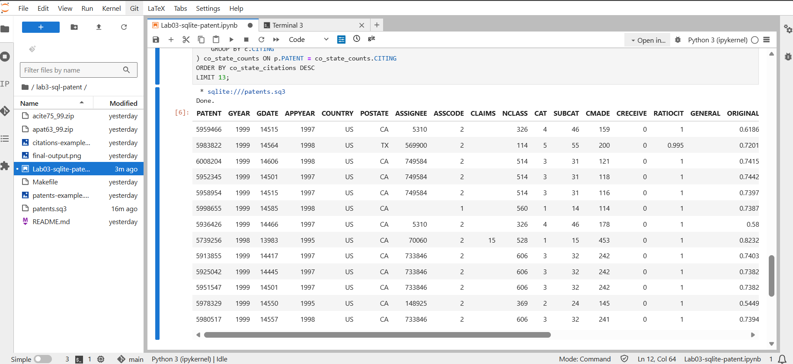

# Lab #3 — Patent Co-State Citations: Solution

## Approach

1. **Join citations with patents twice**  
   For each citation row, we need both the citing patent’s state and the cited patent’s state.  
   - Join `citations` → `patents` on `CITED = PATENT` → get `CITED_STATE` (e.g. `cited_p.POSTATE`).  
   - Join `citations` → `patents` on `CITING = PATENT` → get `CITING_STATE` (e.g. `citing_p.POSTATE`).

2. **Filter co-state citations**  
   Keep only rows where:
   - `CITING_STATE = CITED_STATE`, and  
   - both states are `IS NOT NULL`.

3. **Count per citing patent**  
   `GROUP BY c.CITING` and `COUNT(*)` to get the number of co-state citations for each citing patent.

4. **Augment full patent table**  
   `LEFT JOIN` this aggregate back to `patents` on `PATENT = CITING`, so we keep **all** patents.  
   Use `COALESCE(..., 0)` so patents with no co-state citations get `0`.

5. **Sort**  
   `ORDER BY co_state_citations DESC` so highest co-state counts appear first.

---

## Final SQL Query

```
%%sql
SELECT p.*, COALESCE(co_state_counts.co_state_citations, 0) as co_state_citations
FROM patents p
LEFT JOIN (
    SELECT 
        c.CITING,
        COUNT(*) as co_state_citations
    FROM citations c
    JOIN patents cited_p ON c.CITED = cited_p.PATENT
    JOIN patents citing_p ON c.CITING = citing_p.PATENT
    WHERE cited_p.POSTATE = citing_p.POSTATE
      AND cited_p.POSTATE IS NOT NULL AND cited_p.POSTATE <> ''
      AND citing_p.POSTATE IS NOT NULL AND citing_p.POSTATE <> ''
    GROUP BY c.CITING
) co_state_counts ON p.PATENT = co_state_counts.CITING
ORDER BY co_state_citations DESC
LIMIT 13;
```

## Output

